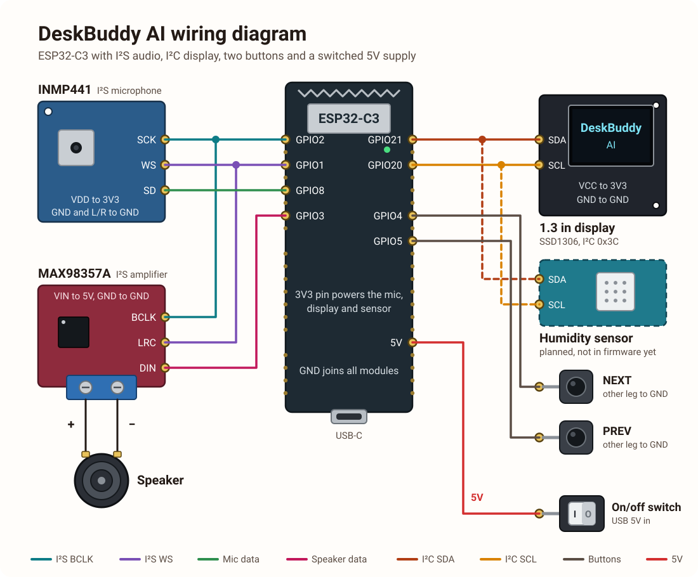

# DeskBuddy AI

A small voice assistant built around an ESP32-C3. Hold a button, speak, and DeskBuddy answers out loud. It can tell you the time and weather and control Spotify on your phone.

## How it works

1. **ESP32-C3** records up to 3 seconds of audio from an INMP441 microphone while you hold a button.
2. The WAV audio is sent over Wi-Fi to a **Flask server on your laptop** (`server.py`).
3. The server calls **OpenAI** for speech-to-text, a chat answer and text-to-speech.
4. Weather questions are answered with live data from Open-Meteo. Spotify commands go to the Spotify Web API.
5. The server streams 24 kHz 16-bit mono PCM audio back, and the ESP32 plays it through a MAX98357A amplifier and speaker.

## Hardware

- ESP32-C3
- INMP441 I2S microphone
- MAX98357A I2S amplifier and a speaker
- Display (the sketch in this repo drives an SSD1306 OLED over I2C)
- Humidity sensor
- 2 push buttons and an on/off switch

### Wiring diagram



### Pins used in `OpenSource.ino`

| Function | GPIO |
| --- | --- |
| Button next / hold to talk | 4 |
| Button previous / hold to talk | 5 |
| I2S BCLK | 2 |
| I2S WS | 1 |
| Microphone data in | 8 |
| Display SDA | 21 |
| Display SCL | 20 |
| Speaker data out | 3 |

Short press scrolls pages (Wi-Fi, Weather, Room, Spotify). Holding a button for 600 ms records your voice.

## Server setup

1. Install Python 3.10+ and run `pip install flask openai python-dotenv`.
2. Create a `.env` file next to `server.py`:

   ```
   OPENAI_API_KEY=your_key
   SPOTIFY_CLIENT_ID=your_client_id
   SPOTIFY_CLIENT_SECRET=your_client_secret
   SPOTIFY_REDIRECT_URI=http://127.0.0.1:5000/spotify/callback
   ```

3. In the Spotify developer dashboard, create an app and add the same redirect URI.
4. Run `python server.py`, then open `http://127.0.0.1:5000/spotify/login` once to authorize.
5. Open Spotify on your phone so it appears as an available device.

## Firmware setup

1. Open `OpenSource.ino` in the Arduino IDE with the ESP32 board package installed.
2. Install the libraries ArduinoJson, Adafruit GFX and Adafruit SSD1306.
3. Fill in `WIFI_SSID`, `WIFI_PASSWORD` and `SERVER_HOST` (your laptop's IPv4 address).
4. Upload the sketch.

## Try it

- "What's the weather in Ankara?"
- "Play Tek Tek on Spotify" (or any song)
- "Pause", "next song", "resume"

## Keep secrets out of Git

Never commit `.env`, `spotify_token.json` or `conversation_id.txt`.
